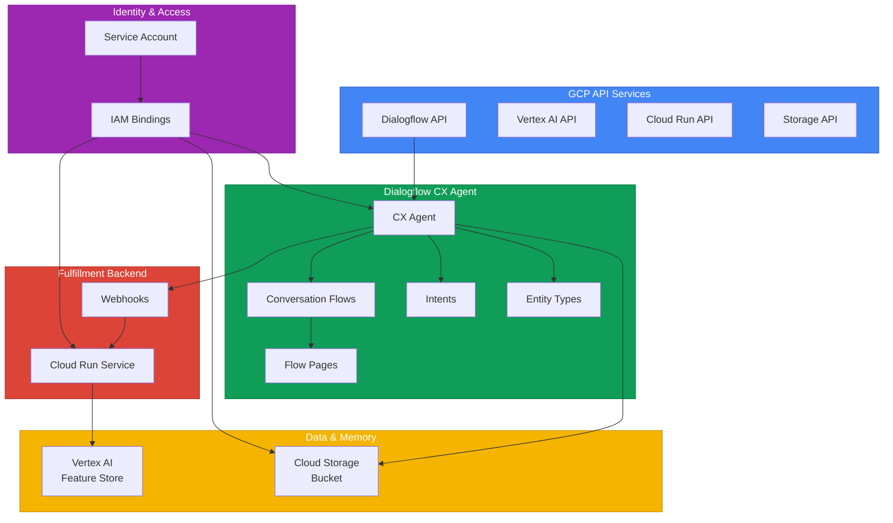

# terraform-gcp-vertex-ai-agents

Terraform module for deploying GCP Vertex AI Agent Builder with Dialogflow CX, conversational AI agents, grounding, webhook fulfillment, and multi-turn dialogue support.

## Architecture



## Documentation

- [Dialogflow CX / Vertex AI Agents Documentation](https://cloud.google.com/dialogflow/vertex/docs)
- [Vertex AI Agent Builder Overview](https://cloud.google.com/vertex-ai/docs/generative-ai/agent-builder/overview)
- [Terraform google_dialogflow_cx_agent](https://registry.terraform.io/providers/hashicorp/google/latest/docs/resources/dialogflow_cx_agent)
- [Dialogflow CX Concepts](https://cloud.google.com/dialogflow/cx/docs/concept)
- [Cloud Run v2 Documentation](https://cloud.google.com/run/docs)

## Prerequisites

- Terraform >= 1.5.0
- Google provider >= 5.10.0
- A GCP project with billing enabled
- Appropriate IAM permissions: Dialogflow Admin, Vertex AI User, Cloud Run Admin, Storage Admin
- For Cloud Run webhook backend: a container image pushed to GCR or Artifact Registry
- gcloud CLI authenticated with sufficient permissions

## Deployment Guide

### Step 1: Configure the provider

```hcl
provider "google" {
  project = "my-gcp-project"
  region  = "us-central1"
}
```

### Step 2: Call the module

```hcl
module "vertex_ai_agent" {
  source = "github.com/kogunlowo123/terraform-gcp-vertex-ai-agents"

  project_id         = "my-gcp-project"
  region             = "us-central1"
  agent_display_name = "customer-support"
  description        = "AI-powered customer support agent"
  time_zone          = "America/New_York"

  enable_spell_correction  = true
  enable_speech_adaptation = true
  supported_languages      = ["es", "fr"]

  flows = [
    {
      display_name = "Order Support"
      description  = "Handles order-related inquiries"
      transition_routes = [
        {
          condition        = "$session.params.order_id != null"
          fulfillment_text = "I found your order. Let me look up the details."
        }
      ]
      event_handlers = [
        {
          event   = "sys.no-match-default"
          message = "I'm not sure I understood. Could you tell me your order number?"
        }
      ]
      pages = [
        {
          display_name  = "Collect Order ID"
          entry_message = "Could you please provide your order number?"
          parameters = [
            {
              display_name = "order_id"
              entity_type  = "projects/-/locations/-/agents/-/entityTypes/sys.any"
              required     = true
              prompt       = "What is your order number?"
            }
          ]
        }
      ]
    }
  ]

  intents = [
    {
      display_name = "order.status"
      description  = "User wants to check order status"
      training_phrases = [
        "where is my order",
        "check order status",
        "track my package",
        "order tracking",
        "when will my order arrive"
      ]
    },
    {
      display_name = "order.cancel"
      description  = "User wants to cancel an order"
      training_phrases = [
        "cancel my order",
        "I want to cancel",
        "cancel order",
        "stop my order"
      ]
    }
  ]

  enable_vertex_ai_features = true
  storage_bucket_name       = "my-project-agent-data"

  tags = {
    environment = "production"
    team        = "conversational-ai"
  }
}
```

### Step 3: Deploy

```bash
terraform init
terraform plan -out=tfplan
terraform apply tfplan
```

### Step 4: Test the agent

After deployment, test the agent using the Dialogflow CX Console:

1. Navigate to the [Dialogflow CX Console](https://dialogflow.cloud.google.com/cx)
2. Select your project and region
3. Open the deployed agent
4. Use the "Test Agent" panel to run multi-turn conversations
5. Verify flows, intents, and webhook fulfillment

### Step 5: Deploy the webhook backend (if using Cloud Run)

```bash
# Build and push webhook container
gcloud builds submit --tag gcr.io/my-gcp-project/customer-support-webhook:latest ./webhook/

# Terraform will reference this image in the Cloud Run service
terraform apply
```

## Inputs

| Name | Description | Type | Default | Required |
|------|-------------|------|---------|:--------:|
| `project_id` | GCP project ID | `string` | n/a | yes |
| `region` | GCP region for resource deployment | `string` | n/a | yes |
| `agent_display_name` | Display name for the Dialogflow CX agent | `string` | n/a | yes |
| `default_language_code` | Default language code for the agent | `string` | `"en"` | no |
| `time_zone` | Time zone for the agent | `string` | `"America/New_York"` | no |
| `description` | Description of the agent | `string` | `"Vertex AI-powered conversational agent"` | no |
| `enable_speech_adaptation` | Enable speech adaptation | `bool` | `false` | no |
| `enable_spell_correction` | Enable spell correction for user inputs | `bool` | `true` | no |
| `supported_languages` | Additional supported language codes | `list(string)` | `[]` | no |
| `flows` | List of conversation flow configurations | `list(object)` | See variables.tf | no |
| `intents` | List of intent configurations | `list(object)` | See variables.tf | no |
| `webhook_url` | External webhook URL for fulfillment | `string` | `null` | no |
| `enable_vertex_ai_features` | Enable Vertex AI Feature Store and Cloud Run backend | `bool` | `false` | no |
| `storage_bucket_name` | Name for the GCS bucket for agent data | `string` | `null` | no |
| `tags` | Labels to apply to GCP resources | `map(string)` | `{}` | no |

## Outputs

| Name | Description |
|------|-------------|
| `agent_id` | The unique identifier of the Dialogflow CX agent |
| `agent_name` | The resource name of the Dialogflow CX agent |
| `agent_start_flow` | The start flow ID of the agent |
| `flow_ids` | Map of flow display names to their IDs |
| `intent_ids` | Map of intent display names to their IDs |
| `webhook_ids` | List of webhook IDs |
| `cloud_run_service_url` | URL of the Cloud Run webhook backend service |
| `storage_bucket_id` | The ID of the GCS bucket for agent data |

## License

MIT License - see [LICENSE](LICENSE) for details.
